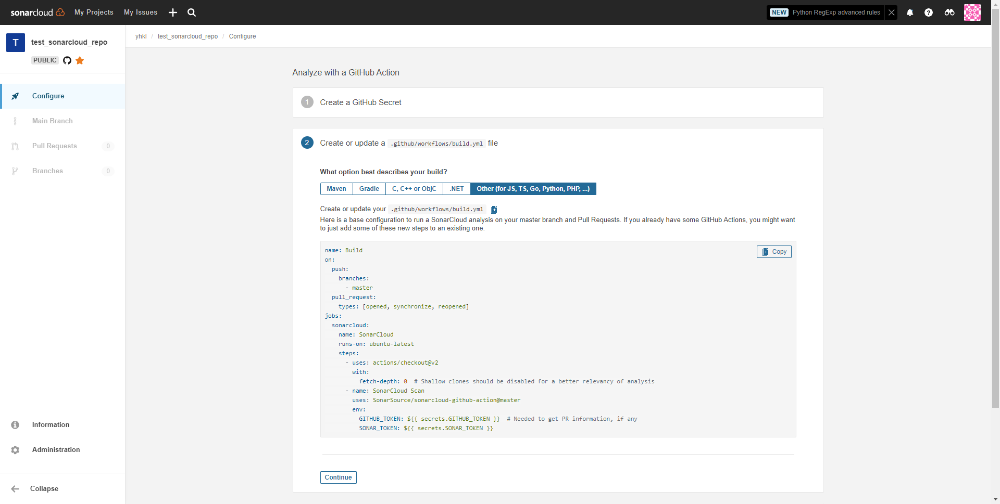

# github_with_sonarqube


test github repo
```
https://github.com/yhkl-dev/test_sonarcloud_repo
```

grant sonarcloud permission


click config


click select repositories to choose which repo you want analyze with sonarcloud


back to sonarcloud


click set up button


choose github actions


configure your github settings of your repo


click add secret

back to sonarcloud


choose your proejct language: 



copy the content and create 
`.github/workflows/build.yml` file in your repo

```
name: Build
on:
  push:
    branches:
      - master
  pull_request:
    types: [opened, synchronize, reopened]
jobs:
  sonarcloud:
    name: SonarCloud
    runs-on: ubuntu-latest
    steps:
      - uses: actions/checkout@v2
        with:
          fetch-depth: 0  # Shallow clones should be disabled for a better relevancy of analysis
      - name: SonarCloud Scan
        uses: SonarSource/sonarcloud-github-action@master
        env:
          GITHUB_TOKEN: ${{ secrets.GITHUB_TOKEN }}  # Needed to get PR information, if any
          SONAR_TOKEN: ${{ secrets.SONAR_TOKEN }}
```


paste the content such as follows


commit your change 

> sonarcloud with analyze your code on master branch and when open/synchronize/reopen a new pull request

back to sonarcloud


click continue


create config file in your root directory of the proejct
and name `it sonar-project.properties`

```
sonar.projectKey=yhkl-dev_test_sonarcloud_repo
sonar.organization=yhkl-dev

# This is the name and version displayed in the SonarCloud UI.
#sonar.projectName=test_sonarcloud_repo
#sonar.projectVersion=1.0

# Path is relative to the sonar-project.properties file. Replace "\" by "/" on Windows.
#sonar.sources=.

# Encoding of the source code. Default is default system encoding
#sonar.sourceEncoding=UTF-8
```

now we create a new branch and test sonarcloud 


create new pull request


you can see sonarcloud analyze your code now


check analyze result in your sonarcloud


And you can see the overview in your pull request as well

